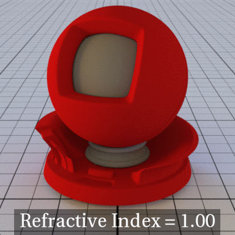

<!-- To set variables and metadata, such as a title and layout, for a page or post on your site, you can add YAML front matter to the top of any Markdown or HTML file. For more information, see "Front Matter" in the Jekyll documentation.  -->

# <Overview_or_introduction>
<!-- All topics>

<!-- Concept info here: Explain the background and context of a this subject. --> 
> Example: 
>The Classic Toaster is a double-slot, stainless steel toaster. It comes with a timer dial and a bagel mode. Have perfect slices of delight with your favorite jam or butter. Easily achieve exquisitely toasted bread with just a push of a button.

`<!-- Task info here -->
>**To toast bread using the Classic Toaster:**
>1. Plug the toaster into an outlet.
>1. Turn the knob to the desired browning level.
>1. Insert a slice of bread into the toaster.
>1. Press down the lever to start toasting.

<!-- Reference info here -->
<!-- Most often, this will be attribute information. Replace this placeholder text with something more appropriate -->
# Attributes

## Common attributes

Felis eget velit aliquet sagittis id consectetur. A arcu cursus vitae congue mauris rhoncus aenean vel.

## <!-- attribute_name -->normalized

<!-- Optional explanation/description here -->

| **Name:**    | normalized      |
|----------|-----------------|
| **Type:**    | bool            |
| **Default:** | true            |
| **Comment:** | Lorem ipsum dolor sit amet, consectetur adipiscing elit, sed do eiusmod tempor incididunt ut labore et dolore magna aliqua. Gravida dictum fusce ut placerat orci. |

## <!-- attribute_name -->## radius

<!-- Optional explanation/description here -->

| **Name:**    | radius  |
|--------------|---------|
| **Type:**    | *float* |
| **Default:** | 1.0     |
| **Comment:** | Lorem ipsum dolor sit amet, consectetur adipiscing elit, sed do eiusmod tempor incididunt ut labore et dolore magna aliqua. Gravida dictum fusce ut placerat orci. |
