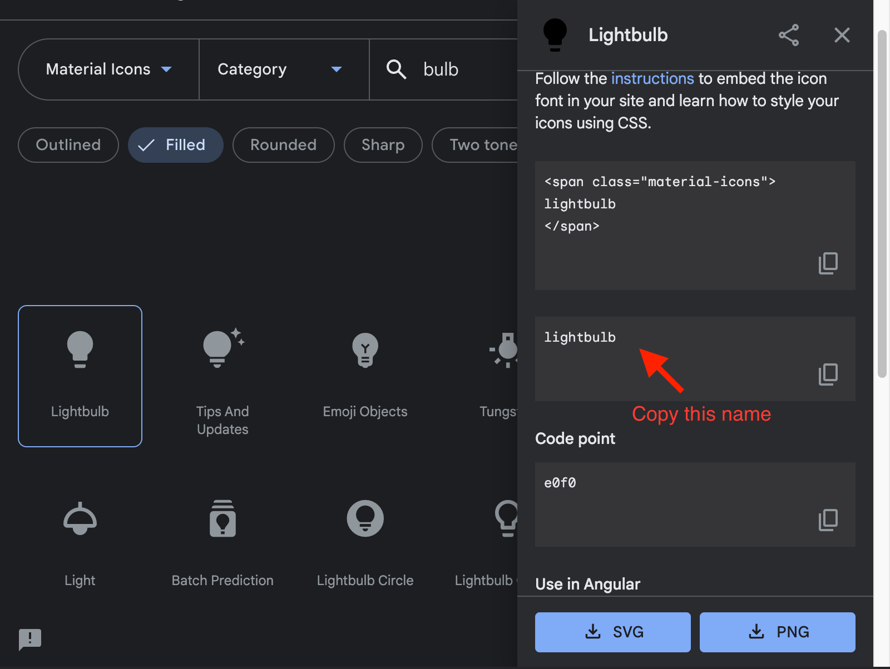

# Style Reference

Heading one is illustrated by the title of this page. Use only one per page.

Spacing between multiple paragraphs is illustrated here.

Heading two ️is illustrated by the heading directly below. This level of heading should be used to separate page sections.

## Typography

### Heading Three

#### Heading Four

##### Heading Five

###### Heading Six

## Links

- <a href="#links" class="link-unvisited">Link (unvisited)</a>
- <a href="#links" class="link-visited">Link (visited)</a>
- <a href="#links" class="link-hover">Link (hover)</a>
- <a href="#links" class="link-active">Link (active)</a>

## Code

This is an example of `inline code`.

```bash
$ moonray_gui -in scene.rdla -in scene.rdlb -out scene.exr
```

```c++
// This function round a floating point number to a certain lowest significant bit from the right
// Rounding is away from zero
finline float roundFloat(const float in, const uint8_t lsb)
{
    float out = in;
    unsigned int *outInt = reinterpret_cast<unsigned int*>(&out);
    if (((*outInt) & 0x7f800000) == 0) return 0; // make all denormalized coding zero
    if (((*outInt) | 0x807fffff) == 0xffffffff) return out; // Inf and NaN remains the same
    *outInt += 1<<lsb;
    *outInt &= ((unsigned int)(-1))<<lsb;
    return out;
}
```

## Asides

> This is a generic callout block, probably most appropriate for quotes and citations (see:&nbsp;[__Quoting in HTML__](https://css-tricks.com/quoting-in-html-quotations-citations-and-blockquotes/))

<aside> <!-- Also: <aside class="info-aside"> -->
<p>This is an info aside block that can hold any html.</p>
<p>You can not use markdown syntax within it.</p>
</aside>
{: .info-aside}

<aside> <!-- Also: <aside class="warn-aside"> -->
<p>This is a warning aside block that can hold any html.</p>
<p>You can not use markdown syntax within it.</p>
</aside>
{: .warn-aside}

## Images

Bare image.


Image with a width constraint.

{: style="width: calc(1/3 * 100%)"}

Full-width.

{: .full-width}

---

<div class="wrap-text-right" markdown="1">


<!-- Alternatively, use an image with a caption.
<figure class="with-caption">
  
  <figcaption>
  An image with a caption
  </figcaption>
</figure>
-->

Image with text wrapping. Use the `wrap-text-left` and `wrap-text-right` classes to wrap to either side. The first element child of the wrapper `<div class="wrap-text-*">` can be an image, or even the `figure/figcaption` example shown directly below.

Lorem ipsum dolor sit amet, consectetur adipiscing elit, sed do eiusmod tempor incididunt ut labore et dolore magna aliqua. Ut enim ad minim veniam, quis nostrud exercitation ullamco laboris nisi ut aliquip ex ea commodo consequat. Duis aute irure dolor in reprehenderit in voluptate velit esse cillum dolore eu fugiat nulla pariatur. Excepteur sint occaecat cupidatat non proident, sunt in culpa qui officia.

Lorem ipsum dolor sit amet, consectetur adipiscing elit, sed do eiusmod tempor incididunt ut labore et dolore magna aliqua. Ut enim ad minim veniam, quis nostrud exercitation ullamco laboris nisi ut aliquip ex ea commodo consequat. Duis aute irure dolor in reprehenderit in voluptate velit esse cillum dolore eu fugiat nulla pariatur. Excepteur sint occaecat cupidatat non proident, sunt in culpa qui officia deserunt mollit anim id est laborum.

</div>

---

<figure class="with-caption">
  
  <figcaption>
  An image with a caption
  </figcaption>
</figure>

---

Image gallery.


---

Image comparer.

<sl-image-comparer position="25" class="width-1/2 center vertical-spacing">
  <sl-icon slot="handle" library="material" name="drag_indicator"></sl-icon>
  
  
</sl-image-comparer>

## Tables

| USD Prim type | Moonray shader | Notes |
| ------------- | -------------- | ----- |
| BasisCurve | RdlCurveGeometry | no Catmull-Rom pinned or periodic curves |
| Camera | any Moonray camera | no clippingPlanes "fit" type other than width simulated by changing focal length |
| xxxLight (any Lux light) | any Moonray light | Spotlight api turns light into a disc, cone:softness is approximated using moonray's "inner_cone_angle" |
| MoonrayLightFilter [^1] | any Moonray light filter | USD doesn't define any specific filter types : all Moonray light filters are supported. |
| Material | all Moonray material and map shaders | Extra files needed for DCC for non UsdPreviewSurface materials |
| Mesh | RdlMeshGeometry | no loop subdivision, holes, or "smooth" triangleSubdivision mode |
| Points | RdlPointGeometry ||
| PreviewSurface shader | UsdPreviewSurface | only mipmapped textures |
| Procedural [^1] | any geometry procedural ||
| Volume | VdbGeometry ||

## Icons

<p><sl-icon library="material" name="lightbulb"></sl-icon> This is an example of an icon being used inline with text.</p>

Inserting an icon is a matter of using the `<sl-icon>` (docs) custom element from the Shoelace.style component library, and specifiying an icon library (Material Icons is suggested) and icon name.

```html
<sl-icon library="material" name="lightbulb"></sl-icon>
```

Visit https://fonts.google.com/icons?selected=Material+Icons to search the Material Icons library. When you wish to use one of the icons, click it, and refer to the disclosed side panel for the icon name, as shown in the screenshot below.



## Scene Class Attribute Reference

<div class="scene-class">
  <details open>
    <summary>General attributes</summary>
    <p>
      <h3>bound_padding</h3>
      <p class="scene-class-type">
        <b>Float</b>
        default: 0.0
        <p class="scene-class-comments">bound padding defines how much to extend the bounding box of the object. Keep this value as low as possible unless the geometry skips tessellation because control cage bounding box is out of camera frustum but the displacement stretch out of the original object bounding box (pre-displacement). Setting the bound padding too large will consume more memory and tessellation time.</p>
        
        
      </p>
      <h3>input_1</h3>
      <p class="scene-class-type">
        <b>Displacement</b>
        default: None
        <p class="scene-class-comments">Displacement object 1</p>
        
        
      </p>
      <h3>operation</h3>
      <p class="scene-class-type">
        <b>Int</b> <i>enum</i>
            | add = 0 (default)
            | max magnitude = 1
            | min magnitude = 2
        <p class="scene-class-no-doc">No documentation available</p>
      </p>
    </p>
  </details>
</div>


## Miscellaneous

Horizontal rule

---


